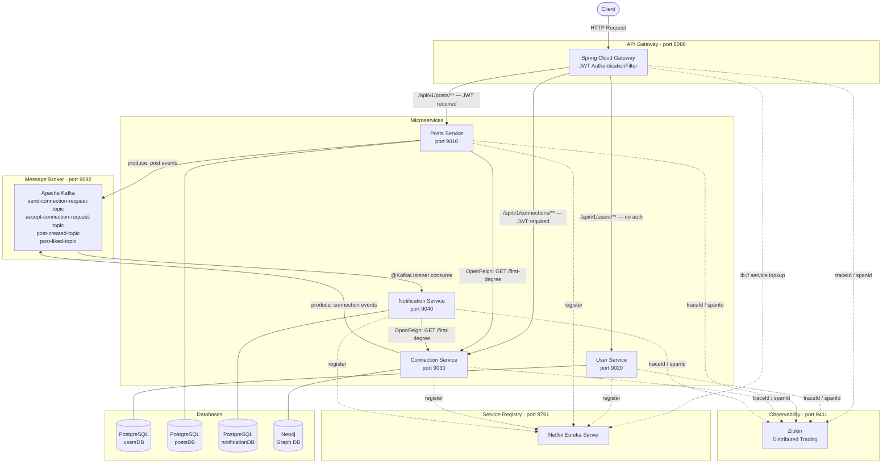

# LinkedInApp — Backend System

A backend application inspired by LinkedIn, built using a **microservices architecture** with Spring Boot. The system handles user authentication, social connections, post management, and real-time notifications across independent, loosely coupled services.

---

## Table of Contents

- [Architecture Overview](#architecture-overview)
- [Services](#services)
- [Tech Stack](#tech-stack)
- [How It Works — End to End](#how-it-works--end-to-end)
- [JWT Authentication & Authorization](#jwt-authentication--authorization)
- [Event-Driven Communication (Kafka)](#event-driven-communication-kafka)
- [Database Design](#database-design)
- [Service Discovery & API Gateway](#service-discovery--api-gateway)
- [Distributed Tracing & Logging](#distributed-tracing--logging)
- [API Endpoints](#api-endpoints)
- [Running the Project Locally](#running-the-project-locally)

---

## Architecture Overview

The application is split into 5 independently deployable Spring Boot microservices. All external traffic enters through the **API Gateway**, which handles JWT validation before routing requests. Services register themselves with **Eureka Discovery Server** so the gateway and inter-service clients can resolve them by name rather than hardcoded URLs.



---

## Services

### 1. Discovery Server
- Runs **Netflix Eureka Server**.
- All other services register as Eureka clients on startup.
- The API Gateway uses Eureka for **load-balanced routing** (`lb://SERVICE-NAME`).

### 2. API Gateway
- Entry point for all client requests, running on **port 8080**.
- Built with **Spring Cloud Gateway (WebFlux/reactive)**.
- Routes:
  - `/api/v1/users/**` → User Service *(no auth required — sign up / login)*
  - `/api/v1/posts/**` → Posts Service *(JWT required)*
  - `/api/v1/connections/**` → Connection Service *(JWT required)*
- Contains a custom `AuthenticationFilter` that:
  1. Reads the `Authorization: Bearer <token>` header.
  2. Validates the JWT signature using HMAC-SHA256.
  3. Extracts the `userId` from the token claims.
  4. Injects the `X-User-Id` header into the downstream request — so no downstream service needs to re-parse the token.

### 3. User Service
- Handles **user registration and login**.
- Passwords are hashed using **BCrypt** before being stored.
- On successful login, generates a signed **JWT** containing `userId` and `email` as claims, with a configurable expiry.
- Uses **PostgreSQL** (`usersDB`) with Spring Data JPA / Hibernate.

### 4. Connection Service
- Manages the **social graph** of users (who is connected to whom).
- Uses **Neo4j** (graph database) to model relationships between users as nodes (`Person`) and relationships (`CONNECTED_TO`, `REQUESTED_TO`).
- Supports: send connection request, accept request, reject request, and fetch first-degree connections.
- Custom **Cypher queries** are written directly in the repository layer using `@Query`.
- On send/accept events, publishes messages to **Kafka topics** to trigger notifications.
- Kafka topics: `send-connection-request-topic` (3 partitions), `accept-connection-request-topic` (3 partitions).

### 5. Posts Service
- Allows authenticated users to **create posts, view a post, and list all posts by a user**.
- Supports **liking and unliking posts** with duplicate-like prevention.
- On post creation, publishes a `PostCreatedEvent` to the `post-created-topic` Kafka topic.
- On post like, publishes a `PostLikedEvent` to the `post-liked-topic` Kafka topic.
- Uses **OpenFeign** (`ConnectionsClient`) to synchronously fetch the creator's first-degree connections from Connection Service — used to determine whose feed should be notified.
- Uses **PostgreSQL** (`postsDB`) with Spring Data JPA / Hibernate.

### 6. Notification Service
- A **pure consumer service** — it does not expose any public REST endpoints.
- Listens to 4 Kafka topics using `@KafkaListener`:
  - `send-connection-request-topic` — notifies receiver of a new request.
  - `accept-connection-request-topic` — notifies sender that their request was accepted.
  - `post-created-topic` — fetches all connections of the post creator via OpenFeign and notifies each one.
  - `post-liked-topic` — notifies the post owner that their post was liked.
- Persists all notifications to **PostgreSQL** (`notificationDB`).

---

## Tech Stack

| Category | Technology |
|---|---|
| Language | Java 17 |
| Framework | Spring Boot |
| API Gateway | Spring Cloud Gateway (WebFlux) |
| Service Discovery | Spring Cloud Netflix Eureka |
| Inter-service HTTP | OpenFeign |
| Messaging | Apache Kafka |
| Relational DB | PostgreSQL |
| Graph DB | Neo4j |
| ORM | Spring Data JPA, Hibernate, Spring Data Neo4j |
| Authentication | JWT (JJWT library), BCrypt |
| Distributed Tracing | Zipkin (Micrometer Tracing) |
| Logging | Logback (rolling file + console, ELK-ready) |
| Build Tool | Maven |

---

## How It Works — End to End

### User Registration & Login
1. Client sends `POST /api/v1/users/auth/signup` with name, email, password.
2. Gateway routes to User Service (no auth filter on this path).
3. User Service hashes the password with BCrypt and saves to PostgreSQL.
4. Client sends `POST /api/v1/users/auth/login` — receives a JWT on success.

### Sending a Connection Request
1. Client sends `POST /api/v1/connections/core/request/{userId}` with Bearer token.
2. Gateway's `AuthenticationFilter` validates the JWT, extracts `senderId`, injects `X-User-Id` header.
3. Connection Service reads `X-User-Id`, checks Neo4j that no duplicate request or existing connection exists.
4. Creates `(sender)-[:REQUESTED_TO]->(receiver)` relationship in Neo4j.
5. Publishes `SendConnectionRequestEvent` to Kafka `send-connection-request-topic`.
6. Notification Service consumes the event and saves a notification for the receiver.

### Creating a Post
1. Client sends `POST /api/v1/posts/core` with Bearer token and post content.
2. Gateway validates JWT, injects `X-User-Id`.
3. Posts Service saves the post to PostgreSQL.
4. Publishes `PostCreatedEvent` (postId, creatorId, content) to `post-created-topic`.
5. Notification Service consumes the event, calls Connection Service via OpenFeign to get the creator's connections, and saves a notification for each connection.

### Liking a Post
1. Client sends `POST /api/v1/posts/likes/{postId}` with Bearer token.
2. Posts Service checks the post exists and the user hasn't already liked it.
3. Saves the like to PostgreSQL, then publishes `PostLikedEvent` to `post-liked-topic`.
4. Notification Service consumes the event and notifies the post owner.

---

## JWT Authentication & Authorization

The project uses a **stateless, signature-based JWT flow**:

- **Issued by:** User Service on login using JJWT library with HMAC-SHA256 signing.
- **Validated by:** API Gateway's `AuthenticationFilter` — the same secret key is shared.
- **Propagated as:** After validation, the gateway strips the token and adds the `X-User-Id` header. Downstream services read this header via a `UserContextHolder` (thread-local) utility — they never touch the JWT directly.
- **Claims stored:** `userId` (subject), `email`, `issuedAt`, `expiration`.

```
Client → [Authorization: Bearer <jwt>] → Gateway
Gateway → validates JWT → extracts userId
Gateway → [X-User-Id: 42] → Downstream Service
Downstream → UserContextHolder.getCurrentUserId() → 42
```

---

## Event-Driven Communication (Kafka)

All asynchronous communication between services goes through **Apache Kafka**. This decouples services so that, for example, a notification failure does not affect the connection or post operation.

| Topic | Producer | Consumer | Purpose |
|---|---|---|---|
| `send-connection-request-topic` | Connection Service | Notification Service | Notify user of incoming request |
| `accept-connection-request-topic` | Connection Service | Notification Service | Notify sender of accepted request |
| `post-created-topic` | Posts Service | Notification Service | Notify connections of new post |
| `post-liked-topic` | Posts Service | Notification Service | Notify post owner of a like |

- All topics are created with **3 partitions** and replication factor 1.
- Events are serialized as **JSON** using Spring Kafka's `JsonSerializer` / `JsonDeserializer`.
- Kafka consumer group ID is set to the consuming service's application name.

---

## Database Design

### PostgreSQL (Relational)
Used by User Service, Posts Service, and Notification Service.

| Service | Database | Key Tables |
|---|---|---|
| User Service | `usersDB` | `users` (id, name, email, password) |
| Posts Service | `postsDB` | `post` (id, userId, content), `post_like` (id, postId, userId) |
| Notification Service | `notificationDB` | `notification` (id, userId, message) |

Schema is managed by **Hibernate DDL auto-update** (`spring.jpa.hibernate.ddl-auto=update`).

### Neo4j (Graph Database)
Used exclusively by Connection Service to model the social graph.

- **Node:** `Person` (userId, name)
- **Relationship types:**
  - `REQUESTED_TO` — pending connection request
  - `CONNECTED_TO` — accepted connection (bidirectional)

Custom Cypher queries handle graph traversal for first-degree connections and relationship existence checks.

---

## Service Discovery & API Gateway

- **Eureka Server** runs on port `8761`. All services register on startup with their application name.
- The **API Gateway** resolves service URIs using the pattern `lb://SERVICE-NAME`, which triggers Eureka lookup + client-side load balancing.
- Route filters use `StripPrefix=2` to remove the `/api/v1` path prefix before forwarding to the downstream service's own context path.

```yaml
# Example route in api-gateway/application.yml
- id: connection-service
  uri: lb://CONNECTION-SERVICE
  predicates:
    - Path=/api/v1/connections/**
  filters:
    - StripPrefix=2
    - name: AuthenticationFilter
```

---

## Distributed Tracing & Logging

### Zipkin
- All services are configured with **Micrometer Tracing** at 100% sampling rate.
- Every request generates a `traceId` and `spanId` that propagate across service boundaries.
- Traces are sent to Zipkin at `http://localhost:9411/api/v2/spans`.
- This allows viewing the complete call chain for any request across all services in the Zipkin UI.

### Logback (ELK-Ready)
- Each service has a `logback-spring.xml` configured with:
  - **Console appender** for development.
  - **Rolling file appender** — rotates daily and by size (10 MB max), retains 30 days of history. Logs are written to `logs/{serviceName}/`.
- Every log line includes `[traceId-spanId]` from the MDC, making logs correlatable with Zipkin traces and ready for ingestion into an ELK stack (Elasticsearch, Logstash, Kibana).

---

## API Endpoints

### User Service — `localhost:9020/users`
| Method | Endpoint | Auth | Description |
|---|---|---|---|
| POST | `/auth/signup` | No | Register a new user |
| POST | `/auth/login` | No | Login and receive JWT |

### Posts Service — `localhost:9010/posts`
| Method | Endpoint | Auth | Description |
|---|---|---|---|
| POST | `/core` | Yes | Create a post |
| GET | `/core/{postId}` | Yes | Get a post by ID |
| GET | `/core/users/{userId}/allPosts` | Yes | Get all posts of a user |
| POST | `/likes/{postId}` | Yes | Like a post |
| DELETE | `/likes/{postId}` | Yes | Unlike a post |

### Connection Service — `localhost:9030/connections`
| Method | Endpoint | Auth | Description |
|---|---|---|---|
| GET | `/core/first-degree` | Yes | Get all first-degree connections |
| POST | `/core/request/{userId}` | Yes | Send a connection request |
| POST | `/core/accept/{userId}` | Yes | Accept a connection request |
| POST | `/core/reject/{userId}` | Yes | Reject a connection request |

> All authenticated endpoints must include `Authorization: Bearer <token>` header.
> Via API Gateway, prefix all paths with `/api/v1` (e.g., `/api/v1/posts/core`).

---

## Running the Project Locally

### Prerequisites
Ensure the following are running locally:

| Service | Port |
|---|---|
| PostgreSQL | 5432 |
| Neo4j | 7687 |
| Apache Kafka + Zookeeper | 9092 |
| Zipkin | 9411 |

### Startup Order
Start the services in this order to avoid registration failures:

```
1. discovery-server     (port 8761)
2. user-service         (port 9020)
3. connection-service   (port 9030)
4. posts-service        (port 9010)
5. notification-service (port 9040)
6. api-gateway          (port 8080)
```

### Build & Run Each Service
```bash
cd <service-folder>
./mvnw spring-boot:run
```

### Databases Required
```
PostgreSQL:
  - usersDB
  - postsDB
  - notificationDB

Neo4j:
  - Default database (bolt://localhost:7687)
  - Username: neo4j / Password: (as configured in application.properties)
```

---
